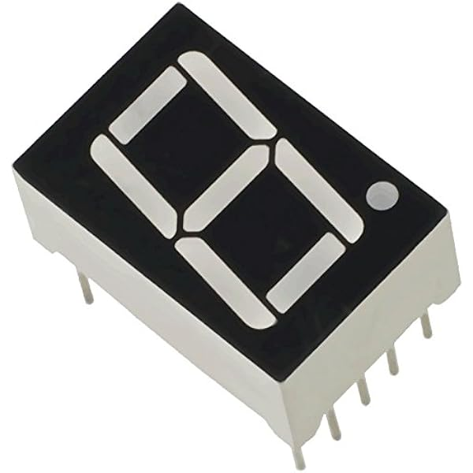
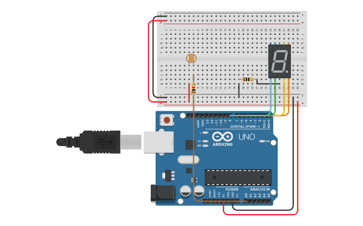

# Prikazovalnik svetlosti, napisan v Assemblerju za Arduino Uno.

 

# O projektu

#### Projekt je bil narejen v sklopu predmeta Laboratorijske vaje na Vegovi. Svetlost se prikazuje v obliki številk od 0 do 9 na spodaj prikazanem zaslonu.

 

 

# Kako deluje?

#### Program `photoresisotr.asm` prebere vrednost svetlosti, ki jo zazna fotorezistor in jo pretvori v številko. To številko nato uporabi program `computer.asm`, ki izvede ustrezno kodo iz `display.asm` s katero prikaže ustrezno številko na zaslonu.

 

# Konfiguracija

#### Za delovanje je potrebno povezati Arduino Uno z zaslonom in fotorezistorjem kot je prikazano na spodnji sliki ali pa kliknite [tukaj](https://www.tinkercad.com/things/igxp6hfEISx-fantastic-jaagub).

 

